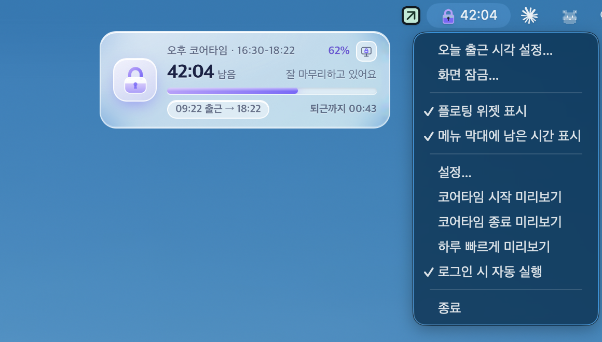
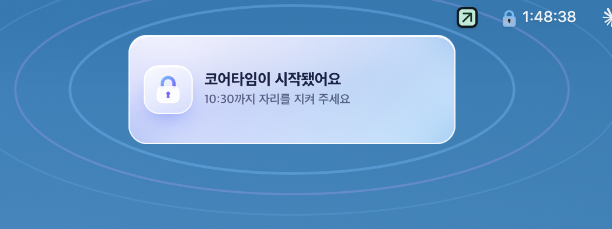
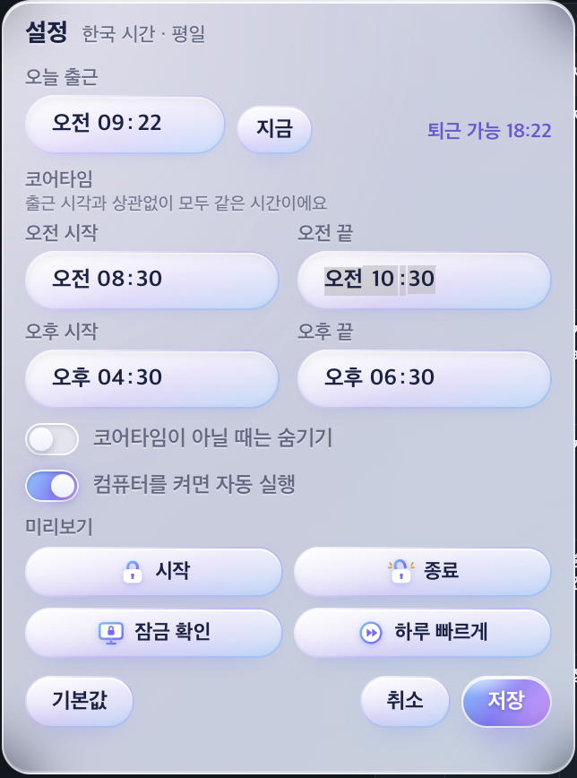

# 🔒 코어타이머 (CoreTimer)

> 하루 중 꼭 집중해야 하는 시간을 정해 두고, 그 시간을 지킬 수 있게 도와주는 데스크톱 위젯입니다.



**[⬇️ 최신 버전 내려받기 (Releases)](https://github.com/darams4863/core-timer/releases/latest)** · macOS · Windows

---

## 어떤 도구인가요

**코어타임**은 하루 중 자리를 지키며 집중하기로 정한 시간입니다. 시차출퇴근제처럼 회사가 정해 둔 시간일 수도 있고, 스스로 정한 몰입 시간일 수도 있어요.

코어타이머는 이 시간을 **오전·오후로 각각 지정**해 두면, 화면 한쪽에 작게 떠서

- 지금 코어타임인지, **얼마나 남았는지** 진행률로 보여 주고
- 시작 10분 전에 미리 알려 주고, 시작과 끝을 알림으로 짚어 주고
- 출근 시각을 넣으면 **퇴근 가능 시각**까지 계산해 줍니다.

시계를 따로 확인하지 않아도 "지금은 집중할 시간"이라는 걸 자연스럽게 의식하게 돼서, **정해 둔 시간에 흐름을 끊기지 않고 일하는 데** 도움이 됩니다.

### 이런 분께 좋아요

- 시차출퇴근제·유연근무제에서 코어타임을 지켜야 하는 분
- 오전·오후에 각각 "방해받지 않는 집중 시간"을 정해 두고 싶은 분
- 퇴근 가능 시각을 매번 계산하기 귀찮은 분
- 시간을 자꾸 까먹는 분 (저요 🙌)

### 만든 계기

회사에 코어타임이 생겼는데, 저는 그걸 자꾸 잊었습니다. 출근하자마자 커피를 사러 잠깐 자리를 비웠다가 아직 코어타임이라는 걸 그제야 알아차린 날, "까먹을 수 없게 눈앞에 띄워 두자"는 생각으로 만들었어요. 만들고 보니 회사 규칙을 지키는 용도뿐 아니라, 하루를 집중 구간과 여유 구간으로 나눠 쓰는 데에도 꽤 쓸모가 있었습니다.

---

## 주요 기능

| 기능 | 설명 |
| --- | --- |
| ⏱ 코어타임 타이머 | 오전·오후 구간을 각각 지정 (기본 08:30–10:30 / 16:30–18:30). 평일에만 동작, 한국 시간 기준 |
| 🔒 유리 자물쇠 | 코어타임엔 잠기고 진행률만큼 차오름, 끝나면 열림 |
| 🔔 알림 | 시작 10분 전 경고, 시작 알림, 종료 시 컨페티 축하 |
| 🏃 퇴근 가능 시각 | 08:30 이후 "출근하셨나요?"를 한 번 묻고 출근 + 9시간으로 계산. 매일 초기화 |
| 🖥 화면 잠금 확인 | 위젯의 잠금 버튼은 코어타임 중 한 번 더 확인. 단축키로 잠갔다 돌아오면 자리 비운 시간을 알려 줌 |
| 🚫 종료 방지 | 코어타임 중에는 앱을 종료할 수 없음 |
| 🪟 위젯 | 드래그로 이동, 위치 기억, 멀티 모니터 대응, 우클릭하면 설정 |
| 📍 메뉴 막대 / 트레이 | Mac은 남은 시간을 글자로, Windows는 아이콘 안 숫자로 표시 |
| 👀 미리보기 | 설정에서 시작 · 종료 · 잠금 확인 · **하루 빠르게**(07:50→19:00을 약 40초에) |

코어타임이 시작될 때와 끝날 때 (macOS)

<p>
  
  
</p>

설정 화면



Windows에서 실행한 모습


---

## 설치

[Releases](https://github.com/darams4863/core-timer/releases/latest)에서 내려받으세요.

### macOS
1. `CoreTimer-Mac.zip`을 내려받아 압축을 풉니다.
2. 터미널에서 실행합니다.
   ```sh
   zsh install-core-timer-mac.sh
   ```
3. 처음 빌드는 5~10분 걸립니다. 끝나면 메뉴 막대에 자물쇠 아이콘이 생깁니다.

> Xcode Command Line Tools, Node.js 22.12+ 가 필요합니다. 없으면 스크립트가 안내합니다.

### Windows
1. `CoreTimer_0.1.0_x64-setup.exe`를 실행합니다.
2. 파란 "Windows의 PC 보호" 창이 뜨면 **추가 정보 → 실행**을 누릅니다.

> 서명·공증을 하지 않은 개인 앱이라 처음 실행할 때 OS 경고가 뜰 수 있습니다.
> Windows 버전은 Mac에서 교차 빌드했고, 아직 많이 써 보지 못했습니다. 문제가 있으면 Issue로 알려 주세요.

---

## 사용 팁

- **위치 옮기기**: 위젯을 끌어서 원하는 곳에 두세요. 위치를 기억합니다.
- **설정 열기**: 위젯 우클릭 또는 메뉴 막대 아이콘 → 설정
- **출근 시각 바꾸기**: 위젯 아래 칩(`＋ 출근 시각` / `09:12 출근 → 18:12`)을 누르세요.
- **코어타임이 아닐 때 숨기기**: 설정에서 켜면 코어타임에만 위젯이 보입니다.

---

## 직접 빌드

필요한 것: Node.js 22.12+, pnpm, Rust (stable), [Tauri OS별 준비물](https://v2.tauri.app/start/prerequisites/)

```sh
pnpm install --frozen-lockfile
pnpm test          # 시간 계산 테스트
pnpm desktop       # 개발 실행
pnpm tauri build   # 현재 OS용 설치 파일
```

- **Mac에서 Windows용 만들기**: `zsh scripts/build-core-timer-windows-on-mac.sh` (cargo-xwin 교차 빌드)
- **GitHub Actions**: `.github/workflows/build.yml`을 수동 실행하면 Windows · macOS · Ubuntu 설치 파일이 아티팩트로 나옵니다.

## 구조

| 경로 | 내용 |
| --- | --- |
| `src/time.ts` | 한국 시간 변환, 코어타임 구간·진행률 계산 (테스트 포함) |
| `src/main.ts` | 위젯 화면, 출근·퇴근 계산, 알림, 설정 |
| `src/alert.ts`, `src/confetti.ts` | 알림 카드 창, 컨페티·물결 효과 창 |
| `src-tauri/src/screen.rs` | OS별 화면 잠금 감지·잠그기 |
| `src-tauri/src/icon.rs` | 트레이 자물쇠 아이콘을 코드로 그리기 |

**기술**: Tauri 2 (Rust) · TypeScript · Vite · 프레임워크 없이 순수 DOM

---

## 참고

- macOS와 Windows는 UI에 미세한 차이가 있지만 기능은 동일합니다.
- 버그나 아이디어는 [Issues](https://github.com/darams4863/core-timer/issues)에 남겨 주세요.
