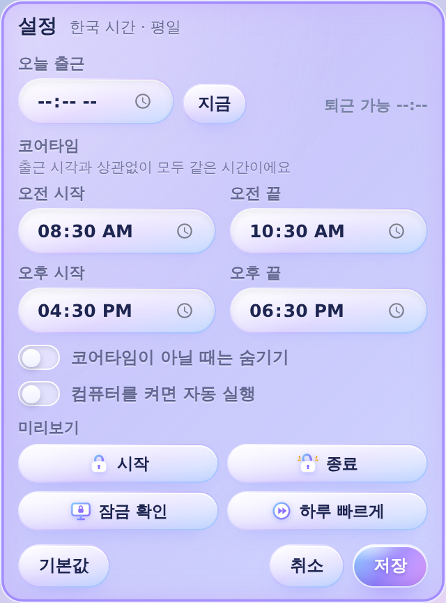

# 코어타이머 (CoreTimer)

코어타임 남은 시간을 화면 한쪽에 띄워 두는 작은 데스크톱 위젯입니다. macOS · Windows · Ubuntu에서 동작합니다.

<p>
  
  
</p>

## 왜 만들었나

회사에 시차출퇴근제가 시범 도입되면서 **코어타임**이 생겼습니다. 출근 후 2시간, 퇴근 전 2시간 동안은 자리를 지켜야 하고, 그 시간에는 커피나 개인 용무로 자리를 비우면 안 됩니다.

문제는 제가 그걸 자꾸 까먹는다는 거였어요. 출근 도장을 찍고 커피를 사러 1층에 2분 내려갔다가, 아직 코어타임이라는 걸 잊은 채로 붙잡혔습니다. 출근 시간대(~09:30) 안이었고 도장만 늦게 찍었으면 아무 문제 없었을 상황이라 더 억울했어요.

그래서 **"지금 코어타임인지, 언제 끝나는지"를 눈에 보이는 곳에 항상 띄워 두는 앱**을 만들었습니다. 코어타임 10분 전에는 "커피 마지막 찬스!"라고 알려 주고, 끝나면 컨페티로 축하해 줍니다.

## 기능

- **코어타임 타이머**: 오전 08:30–10:30 / 오후 16:30–18:30 (설정에서 변경), 한국 시간 · 평일만
  - 진행률 바, 남은 시간, 유리 자물쇠가 진행률만큼 차오름
  - 시작 10분 전 경고, 시작 알림, 종료 시 컨페티
- **출근 시각 → 퇴근 가능 시각**: 08:30 이후 "출근하셨나요?"를 한 번 묻고, 출근 + 9시간으로 퇴근 가능 시각을 계산합니다. 출근 시각은 매일 초기화됩니다.
  - 퇴근 가능 시각이 오후 코어타임 안에 오면 그 시각에 코어타임도 함께 끝납니다.
- **화면 잠금 확인**: 위젯의 잠금 버튼으로 잠그면 코어타임 중·10분 전에 한 번 확인합니다. OS 단축키로 잠갔다가 돌아오면 자리 비운 시간을 알려 주고, macOS는 잠금 화면에도 알림이 뜹니다.
- **코어타임 중 종료 방지**: 코어타임에는 앱이 종료되지 않습니다.
- **위젯**: 드래그로 이동, 위치 기억, 멀티 모니터 대응(모니터 분리 시 주 모니터로 복귀), 우클릭하면 설정
- **메뉴 막대 / 트레이**: 자물쇠 아이콘. macOS는 남은 시간을 글자로, Windows는 아이콘 안에 남은 분을 숫자로 표시
- **미리보기**: 설정에서 시작 · 종료 · 잠금 확인 · 하루 빠르게(07:50→19:00을 약 40초에) 확인
- 로그인 시 자동 실행

<p>
  
  
</p>

Windows에서 실행한 모습:


## 설치

| OS | 방법 |
| --- | --- |
| macOS | 소스와 `scripts/install-core-timer-mac.sh`를 같은 폴더에 두고 `zsh install-core-timer-mac.sh` |
| Windows | `CoreTimer_0.1.0_x64-setup.exe` 실행 (파란 경고창이 뜨면 "추가 정보 → 실행") |
| Ubuntu | `.deb` 설치 또는 `.AppImage`에 `chmod +x` 후 실행 |

서명·공증을 하지 않은 앱이라 처음 실행할 때 OS 경고가 뜰 수 있습니다.

## 직접 빌드

필요한 것: Node.js 22.12+, pnpm, Rust (stable), [Tauri OS별 준비물](https://v2.tauri.app/start/prerequisites/)

```sh
pnpm install --frozen-lockfile
pnpm test          # 시간 계산 테스트
pnpm desktop       # 개발 실행
pnpm tauri build   # 현재 OS용 설치 파일
```

- **Mac에서 Windows용 만들기**: `zsh scripts/build-core-timer-windows-on-mac.sh` (cargo-xwin 교차 빌드)
- **GitHub Actions**: `.github/workflows/build.yml`을 수동 실행하면 Windows · macOS · Ubuntu 설치 파일이 아티팩트로 나옵니다.

## 구조

| 경로 | 내용 |
| --- | --- |
| `src/time.ts` | 한국 시간 변환, 코어타임 구간·진행률 계산 (테스트 포함) |
| `src/main.ts` | 위젯 화면, 출근·퇴근 계산, 알림, 설정 |
| `src/alert.ts`, `src/confetti.ts` | 알림 카드 창, 컨페티·물결 효과 창 |
| `src-tauri/src/screen.rs` | OS별 화면 잠금 감지·잠그기 |
| `src-tauri/src/icon.rs` | 트레이 자물쇠 아이콘을 코드로 그리기 |

기술: Tauri 2 (Rust) + TypeScript + Vite, 프레임워크 없이 순수 DOM

## 참고

개인적으로 쓰려고 만든 도구라 회사 시스템과는 연동되지 않습니다. 근태 기록은 각자 그룹웨어 기준으로 확인해 주세요.
